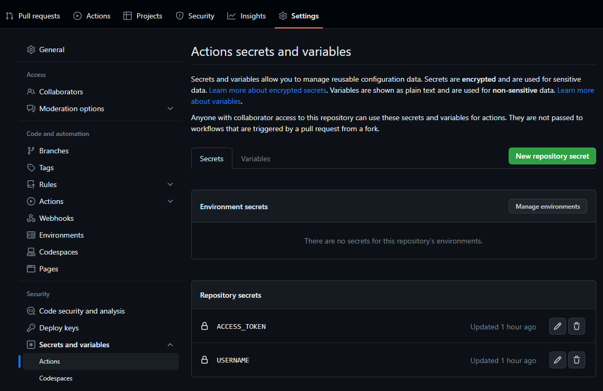
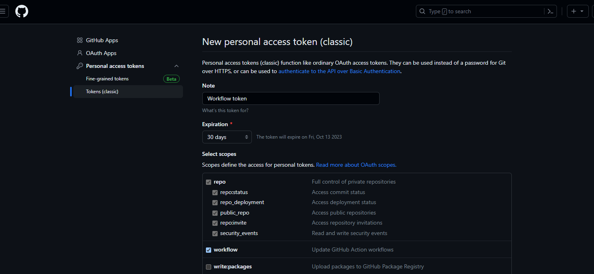
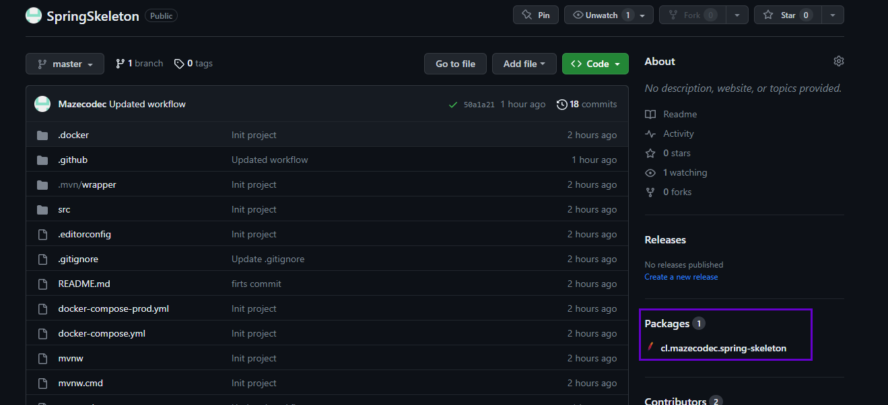
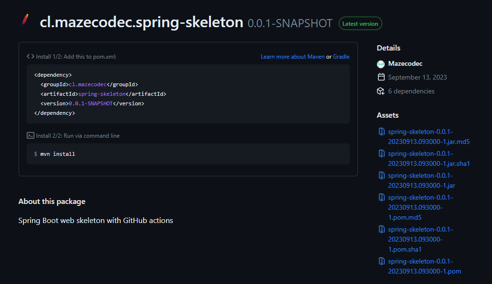

# Uploading a Maven Project to GitHub Packages

This README.md guide will walk you through the steps to upload a Maven project to GitHub Packages. GitHub Packages is a package management service that allows you to host and share
your Maven packages within your GitHub repositories.

Create Token to allow workflow actions



## Prerequisites

Before you start, ensure you have the following:

- A GitHub account
- A Maven project that you want to publish
- Maven installed on your local development environment

### Step 1: Create a GitHub Repository

1. Log in to your GitHub account.
2. Click the '+' icon in the top-right corner and choose 'New Repository'.
3. Fill in the repository name, description, and any other settings you prefer.
4. Make sure the repository is set to public or private according to your needs.
5. Click 'Create repository'.

### Step 2: Prepare Your Maven Project

1. Ensure your Maven project is properly structured and configured.
2. Make sure you have a pom.xml file in the root of your project that specifies the project's information and dependencies.

### Step 3: Configure Your Maven Settings

1. Open your __.github/settings.xml__ file or create it if it doesn't exist.
2. Add your GitHub Packages credentials to the settings file. Replace <USERNAME> and <TOKEN> with your GitHub username and a personal access token.



```xml

<settings>
  <servers>
    <server>
      <id>github</id>
      <username>$USERNAME</username>
      <password>$TOKEN</password>
    </server>
  </servers>
</settings>
```

Those variables can be storaged into secrets and variables from the repository settings as the image shown


4. Add both repositories into profile

```xml

<activeProfiles>
  <activeProfile>github</activeProfile>
</activeProfiles>

<profiles>
<profile>
  <id>github</id>
  <repositories>
    <repository>
      <id>central</id>
      <url>https://repo1.maven.org/maven2</url>
    </repository>
    <repository>
      <id>github</id>
      <url>https://maven.pkg.github.com/$USERNAME/$REPO</url>
      <snapshots>
        <enabled>true</enabled>
      </snapshots>
      <releases>
        <enabled>true</enabled>
      </releases>
    </repository>
  </repositories>
</profile>
</profiles>
```

### Step 4: Update Your POM.xml

1. In your project's pom.xml file, add the GitHub Packages repository to your <distributionManagement> section. Replace <USERNAME> with your GitHub username and <REPO> with the
   repository name you created in Step 1.

```xml

<distributionManagement>
  <repository>
    <id>github</id>
    <url>https://maven.pkg.github.com/$USERNAME/$REPO</url>
  </repository>
</distributionManagement>
```

2. Add the <server> entry inside the <servers> section of your pom.xml, which should match the server configuration in your settings.xml:

```xml

<servers>
  <server>
    <id>github</id>
    <username>$USERNAME</username>
    <password>$TOKEN</password>
  </server>
</servers>
```

### Step 5: Deploy Your Maven Project

1. Navigate to your project's directory in your terminal.
2. Build and deploy your project to GitHub Packages using the following command:

```bash
mvn deploy
```

3. Maven will compile your project, package it, and then upload it to the GitHub Packages repository specified in your pom.xml and settings.xml.

### Step 6: Verify Your Maven Package

1. Go to your GitHub repository's 'Packages' tab.
2. You should see your Maven package listed there.
3. Congratulations! You have successfully uploaded your Maven project to GitHub Packages. You can now use your packages in other projects by specifying them as dependencies in
   their pom.xml files.




For more information on using packages from GitHub Packages in your projects, refer to the [GitHub Packages documentation](https://docs.github.com/en/packages).
